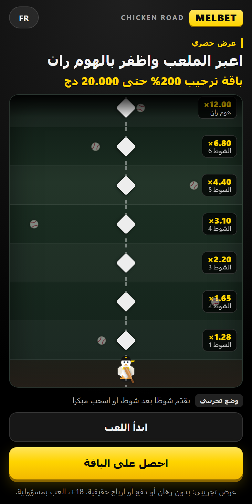
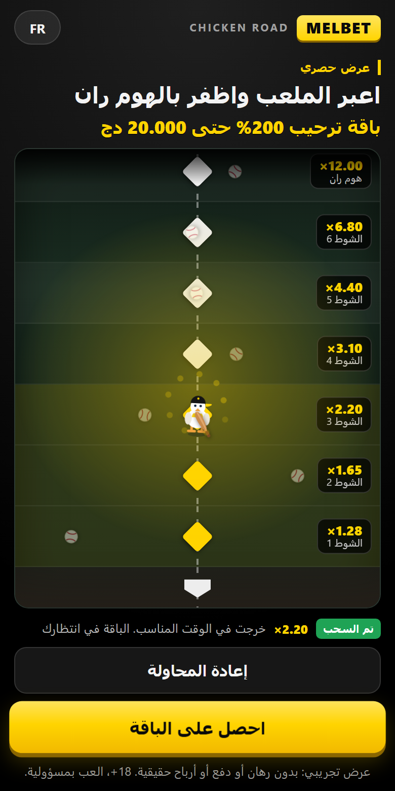
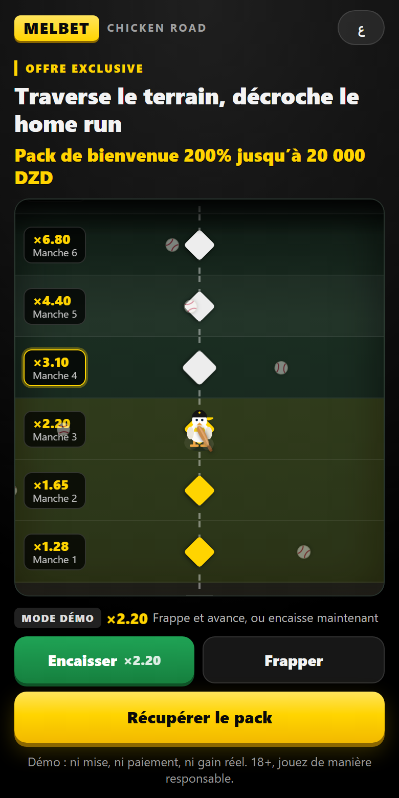
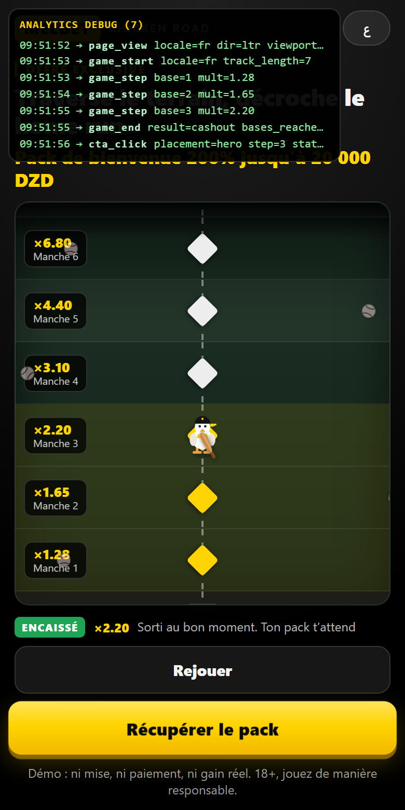

# Chicken Road x Melbet, промо-прототип для GEO Algeria (трек B)

Одноэкранный mobile-first лендинг с короткой имитацией механики Chicken Road в стиле Melbet.
Интерфейс на арабском (RTL, по умолчанию) и французском (LTR). Основной CTA ведёт на тестовый
URL и переносит в него UTM-метки. Аналитика шлёт `page_view` и `cta_click`.

Механика краш-игры взята один в один, а сцена своя, бейсбольная. Зачем, написано ниже в разделе
[Почему бейсбол, а не дорога](#почему-бейсбол-а-не-дорога).

## Демо

**https://dreaddman666.github.io/chicken-road-mlb-promo/**

Хостинг на GitHub Pages, деплой автоматический из ветки `main`.

Быстрые проверки:

* арабский с RTL открывается сразу, без параметров;
* французский с LTR: кнопка языка в шапке или [`?lang=fr`](https://dreaddman666.github.io/chicken-road-mlb-promo/?lang=fr);
* оверлей событий аналитики: [`?debug=1`](https://dreaddman666.github.io/chicken-road-mlb-promo/?debug=1);
* проброс меток: [`?utm_source=facebook&utm_campaign=dz_mlb_aug&debug=1`](https://dreaddman666.github.io/chicken-road-mlb-promo/?utm_source=facebook&utm_campaign=dz_mlb_aug&debug=1);
* [запустить PageSpeed Insights](https://pagespeed.web.dev/analysis?url=https%3A%2F%2Fdreaddman666.github.io%2Fchicken-road-mlb-promo%2F&form_factor=mobile) по этой ссылке.

## Как это играется

### Правила

Весь сценарий помещается в один экран плюс короткий блок под ним.

1. После загрузки сразу видны оффер, поле и жёлтая кнопка CTA. Скроллить не нужно.
2. Кнопка «ابدأ اللعب» / «Commencer» выводит курицу с битой из дома.
3. Дальше каждый тап это одна подача. Отбила: мяч улетает за поле, курица занимает следующую
   базу, коэффициент растёт. Не отбила: мяч попадает в неё, она падает, розыгрыш окончен.
4. В трассе 7 шагов, от ×1.28 до ×12.00. Она длиннее экрана, поэтому поле само проматывается
   вслед за курицей до стены аутфилда.
5. Зелёная кнопка «اسحب الآن» / «Encaisser» появляется с первой взятой базы. Это второй выход
   из сценария, рисковать до конца не обязательно.
6. Любой финал (HOME RUN, ENCAISSÉ, ÉLIMINÉ) подсвечивает CTA.

Ставок, баланса, платежей, регистрации и реального выигрыша тут нет, о чём сказано
в дисклеймере на обоих языках.

| Старт (RTL) | Забрал раньше | Розыгрыш (LTR) |
|---|---|---|
|  |  |  |

### Что происходит на экране

Вся анимация на CSS-трансформах, библиотек нет. При `prefers-reduced-motion` выключается целиком.

| Момент | Что происходит |
|---|---|
| Простой | курица покачивается, по полю летают мячи «разминки» |
| Следующая база | ромб базы пульсирует, чип с коэффициентом подсвечивается жёлтым |
| Тап | замах битой, подача летит по дуге в курицу |
| Попал по мячу | мяч улетает с вращением, прыжок на базу, облачко пыли, ромб становится жёлтым, множитель подскакивает |
| Мяч попал в курицу | мяч тормозит и падает, курица заваливается, красная вспышка, разлетаются перья |
| Хоум-ран или забор | жёлтая вспышка, конфетти, ликование или приподнятая кепка |
| Продвижение | дорожка проматывается, верх поля растворяется, видно что локация продолжается |

## Почему бейсбол, а не дорога

Это главное продуктовое решение проекта.

Chicken Road клонируют десятками, и промо под неё выглядят одинаково: та же курица, те же полосы
асфальта, те же машины. В креативах они сливаются в один шум. Игра узнаётся, рекламодатель нет.

Поэтому механика осталась прежней, а сцена стала своей.

**Правила не поменялись.** Растущий множитель по шагам, растущий риск, забор в любой момент,
обнуление при провале. Игрок, знакомый с Chicken Road, разбирается с первого тапа.

**Сцена работает на основной продукт.** Melbet это в первую очередь букмекер, спорт для него
родная территория. Стадион на лендинге тянет мысль к ставкам, дорога с машинами не тянет никуда.

**У персонажа появилось действие.** Вместо «перебежал полосу» теперь замах битой по летящей
подаче: отбил и пошёл дальше, промазал и тебя выбило. Тап тот же, ощущение другое.

**Сеттинг не вшит в код.** Геометрия дорожки, состояния и аналитика к бейсболу не привязаны,
полосы и персонаж это разметка поля и пара SVG-символов. Переезд на дорогу с машинами
не потребует трогать игровую логику.

## Как устроено

Чистые HTML, CSS и JS. Ноль зависимостей и ноль внешних запросов, пока не включён GA4.
Фреймворк тут стоил бы дороже самой страницы.

### Файлы

```
index.html              разметка и инлайновые SVG-спрайты (курица, бита, мяч, иконки)
assets/config.js        весь конфиг: тексты AR/FR, ссылки, ID аналитики, длина трассы
assets/styles.css       стили и анимации на логических свойствах, RTL получается бесплатно
assets/app.js           i18n, аналитика, UTM, геометрия дорожки, автомат состояний игры
build.js                сборка без зависимостей, инлайнит CSS и JS в один файл
dist/index.html         продакшен-сборка: 1 запрос, ~40 КБ, ~14 КБ под gzip
dist/artifact.html      та же страница для публикации артефактом
scripts/                headless-QA через CDP, статик-сервер с gzip, генератор пруфа аналитики
report/                 скриншоты и HTML-отчёт Lighthouse
.github/workflows/      деплой на GitHub Pages
```

### Конфиг

Всё редактируемое лежит в `assets/config.js`. Секретов там нет и быть не должно, файл публичный.

```js
ctaUrl: 'https://chicken-road-mlb-promo.com',  // адрес оффера
passthroughParams: ['utm_source', ...],        // какие метки переносить в CTA
analytics: { ga4Id: '' },                      // 'G-XXXXXXXXXX' включает GA4, пусто = молчит
game: { bases: [{ mult, risk }, ...] },        // длина трассы = длина этого массива
locales: { ar: {...}, fr: {...} }              // все тексты обоих языков
```

Дорожка строится из конфига на лету. Чтобы удлинить локацию, достаточно добавить строку
в `bases` и подпись `base.N` в обе локали. Разметку и CSS трогать не надо, поле само пересчитает
геометрию и начнёт проматываться раньше.

После правки `npm run build`, либо просто пуш в `main`, тогда соберёт workflow.

Заголовок, оффер, CTA и дисклеймер продублированы прямо в `index.html`, чтобы страница читалась
даже до выполнения JS. При загрузке `config.js` их перезаписывает, так что источник правды один.

### Локализация и RTL

По умолчанию арабский, `<html dir="rtl">` выставляется до первой отрисовки. Переключатель в шапке
меняет `lang` и `dir` у `<html>`, перерисовывает тексты вместе с подписями баз внутри поля
и запоминает выбор в `localStorage`. Можно зайти сразу с `?lang=fr`.

Зеркалирование нигде не захардкожено. Вёрстка использует логические свойства
(`inset-inline-start`, `margin-inline`, `padding-inline`, `text-align: start`), поэтому шапка,
чипы с коэффициентами, статус-строка и кнопки переворачиваются сами.

Пара мест, где пришлось повозиться:

* игровое поле оставлено симметричным, движение снизу вверх. Зеркалить его не нужно,
  и в обоих направлениях оно читается одинаково;
* множители выводятся в изолированных `dir="ltr"` элементах. Без этого в RTL-контексте
  «×12.00» показывается как «12.00×»;
* шрифт системный, с арабскими фолбэками (`Segoe UI`, `Noto Sans Arabic`, `Tahoma`).
  Внешних шрифтов нет вообще, критический контент не ждёт загрузки веб-фонта.

### Аналитика

Обязательный минимум плюс бонусные события трека B.

| Событие | Когда | Параметры |
|---|---|---|
| `page_view` | загрузка | `locale`, `dir`, `viewport`, `utm_source`, `utm_campaign` |
| `cta_click` | клик по основному CTA | `placement` (hero/footer), `step`, `state` |
| `game_start` | старт розыгрыша | `locale`, `track_length` |
| `game_step` | каждая взятая база | `base`, `mult` |
| `game_end` | финал | `result` (`home_run`/`cashout`/`out`), `bases_reached`, `mult` |
| `lang_switch` | смена языка | `to`, `dir` |

Транспорта два.

**GA4.** Интеграция готова, но счётчик намеренно не подключён: `ga4Id` пустой, поэтому страница
не делает наружу ни одного запроса. Достаточно вписать `G-XXXXXXXXXX` в конфиг, править код
не придётся. `gtag.js` грузится лениво, на `load` и `requestIdleCallback`, так что на LCP
не влияет. `send_page_view` выключен, `page_view` отправляется вручную, чтобы событие было одно
и с нужными параметрами.

**Локальный лог.** Рабочий транспорт по умолчанию: последние 50 событий в `localStorage`
(ключ `cr_mlb_events`), плюс `console.info`, плюс визуальный оверлей по `?debug=1`. ТЗ прямо
допускает «простой собственный лог» и требует один скриншот пришедшего события, он ниже.

Полная цепочка одного сеанса: французский, UTM, три базы, досрочный забор, клик по CTA.



Отдельно про запасную ссылку: артефакт отдаётся под строгим CSP, который режет внешние хосты,
поэтому GA4 там не загрузится в принципе и события видно только через `?debug=1`.
На Pages таких ограничений нет.

## Решения и допущения

Ничего из перечисленного в постановке не было, всё выбрано самостоятельно.

### Оффер и коэффициенты

Тестовый URL для CTA в задании не выдавали, поэтому подставлен правдоподобный адрес
`https://chicken-road-mlb-promo.com`. Домен пока не зарегистрирован, это заглушка, а не рабочая
ссылка. Живёт он одной строкой в `assets/config.js`, обе кнопки и сборка берут значение оттуда,
так что замена на боевой оффер это правка одной строки.

Цифры оффера (200% до 20 000 DZD) и коэффициенты (от ×1.28 до ×12.00) выдуманы, точность
не была целью задания.

Вероятности пропущенной подачи растут от 7% к 30%, до хоум-рана доходит примерно четверть сессий.
Риск должен быть настоящим, иначе кнопка досрочного забора не имеет смысла, но обрывать сценарий
на первом же тапе он тоже не должен.

Шаги названы иннингами, а не базами 1-2-3. Их семь, и «седьмая база» была бы ошибкой против
правил бейсбола, а «седьмой иннинг» нет.

### Бренд и графика

Фирменная пара Melbet: жёлтый `#FFD400` на чёрном `#0A0A0A`. Красный оставлен только под
состояние проигрыша, зелёный только под кнопку забора, чтобы ни один акцент не спорил с жёлтым CTA.

Официальные бренд-ассеты не выдавались, поэтому логотип не воспроизводился и не обводился:
слово MELBET набрано шрифтом в жёлтой плашке. Лендинг читается как Melbet, но чужой товарный
знак при этом не тронут.

Вся графика это инлайновые SVG и CSS-анимации. Ни кода, ни спрайтов, ни звуков из существующей
игры Chicken Road не заимствовано. Растровых изображений в проекте нет вообще.

### Аудитория Алжира

**Арабский по умолчанию, французский вторым.** В Алжире арабский официальный, французский
массово используется в вебе и рекламе. Отсюда AR как дефолт и FR в один тап.

**Западные цифры (0-9), а не восточно-арабские (٠١٢).** В Магрибе в быту и рекламе используют
именно западные, восточные выглядели бы машрикскими. Валюта DZD, «دج».

**В кадре нет людей.** Маскот это курица, поэтому вопросы одежды, жестов и мимики просто
не возникают. Курица нейтральна и халяльна. Свинины, алкоголя и религиозной символики нет.

**Национальные цвета Алжира не эксплуатируются.** Палитра чёрно-жёлтая, брендовая. Тёмно-зелёный
на поле это газон стадиона, а не отсылка к флагу.

**Тема азартных игр подана сдержанно.** Ставок, баланса и выигрышей в прототипе нет, есть явная
пометка про демо без реальных денег, 18+ и «играйте ответственно» на обоих языках. Кнопка
досрочного забора заодно работает сигналом вовремя остановиться.

Основной CTA стоит внизу первого экрана, в зоне большого пальца. Высота кнопок от 46 px.

## Скорость

Замеры сделаны Lighthouse Mobile 12.8.2 по живой публичной ссылке, а не по локальному серверу.
Полный отчёт лежит в [`report/lighthouse-mobile.html`](report/lighthouse-mobile.html).

| Метрика | Результат | Ориентир ТЗ |
|---|---|---|
| Performance | 100 | 85+ |
| Accessibility | 100 | |
| Best Practices | 100 | |
| LCP | 0.8 с | 2.5 с |
| FCP и Speed Index | 0.8 с | |
| TBT | 0 мс | |
| CLS | 0 | |
| Вес загрузки | ~14 КБ (40 КБ без сжатия) | 1.5 МБ |

Складывается это из простых вещей: один HTTP-запрос, ноль внешних шрифтов и картинок, вся графика
в SVG и CSS, анимации только на `transform` и `opacity` без layout-трэшинга, GA4 отложен
на `requestIdleCallback`.

### Про SEO 60

Проваливается ровно один аудит, `is-crawlable`. У страницы стоит `<meta name="robots"
content="noindex">`, потому что это прототип с выдуманным оффером и незарегистрированным доменом,
и его индексация была бы вредна. Для боевого лендинга достаточно удалить эту строку
из `index.html`.

В ориентиры ТЗ SEO не входит, там названа только Lighthouse Mobile 85+.

### Что бы сделал дальше

Прогнал бы JS через esbuild на CI. Сейчас код намеренно оставлен читаемым, после gzip экономия
получается меньше килобайта, и на живой ссылке Lighthouse к этому уже не придирается.

Если арабского текста станет заметно больше, подключил бы самостоятельно захостенный сабсет
Noto Sans Arabic вместо системного стека, чтобы типографика совпадала на iOS и Android.

## Тесты

QA гоняется в настоящем headless-Chrome через CDP, без внешних зависимостей. Скрипт лежит
в `scripts/qa.js` и принимает любой URL, так что финальный прогон сделан по живой ссылке.

```bash
node scripts/qa.js https://dreaddman666.github.io/chicken-road-mlb-promo/ ./report
```

Локально то же самое:

```bash
npm run build
npm run serve      # в отдельном терминале
npm run qa         # 360/390/412 px: RTL, LTR, три исхода игры, UTM, скриншоты
npm run proof      # скриншот цепочки событий аналитики
```

Что проверяется на ширинах 360, 390 и 412 px:

| Проверка | Результат |
|---|---|
| Арабский открывается и выглядит RTL | `dir=rtl`, `lang=ar` |
| Французский переключается и выглядит LTR | `dir=ltr`, `lang=fr` |
| CTA виден на первом экране | нижняя граница кнопки внутри вьюпорта на всех трёх ширинах |
| Нет горизонтального скролла | `scrollWidth - clientWidth = 0` |
| Полный проход трассы | 7 баз, финал ×12.00, дорожка промотана |
| Досрочный забор | кнопка появляется с 1-й базы, забор на 3-й даёт `cashout` ×2.20 |
| Проигрыш | подача попадает, статус «خارج اللعب» / «Éliminé» |
| Цепочка событий | `page_view, game_start, game_step ×N, game_end, cta_click` |
| UTM доезжают до CTA | `https://chicken-road-mlb-promo.com/?utm_source=fb&utm_campaign=dz_mlb&subid=abc` |

Что покрыто, но не автотестами: `prefers-reduced-motion` отключает анимации, фоновые мячи встают
на паузу при уходе со вкладки, у кнопок есть видимый `:focus-visible`, состояние игры озвучивается
через `aria-live`.

## Деплой

Настроено и работает. Пуш в `main` запускает workflow, тот собирает `dist/` и публикует его
на https://dreaddman666.github.io/chicken-road-mlb-promo/

```bash
git push origin main
```

Источник страниц переключён на GitHub Actions в Settings → Pages → Source. Включить Pages из
самого workflow нельзя: `configure-pages` с `enablement: true` падает, потому что у `GITHUB_TOKEN`
нет прав администратора репозитория. Это делается один раз руками или через API.

Если понадобится альтернатива, `dist/` можно просто перетащить на https://app.netlify.com/drop,
аккаунт и CLI для этого не нужны. Локально: `npm run build && npm run serve`, дальше
http://127.0.0.1:8787/

## Отступления от ТЗ

**«Короткая имитация Chicken Road».** Механика взята один в один, а сцена своя, бейсбольная.
Лендинги с курицей на дороге неразличимы между собой, здесь же правила узнаются с первого тапа,
но оффер запоминается. Подробнее в разделе [Почему бейсбол, а не дорога](#почему-бейсбол-а-не-дорога).

**«Достаточно 3-5 действий».** Сделано 7 шагов плюс досрочный забор. Забор имеет смысл только
когда впереди есть на что жадничать, короткая лестница не создаёт решения «взять сейчас или
рискнуть». Медианная сессия при этом всё равно короткая, большинство забирает раньше.

**«Перерисовать под стиль бренда, используя выданные материалы».** Материалы не выдавались,
поэтому взята фирменная пара Melbet и набранный шрифтом вордмарк. Воспроизводить чужой товарный
знак в тестовом задании некорректно.

**«Изображения вынесены в конфиг».** Растровых изображений в проекте нет вообще, графика это
инлайновые SVG-символы, а в конфиге лежат их идентификаторы. Так страница весит 40 КБ и делает
один запрос вместо загрузки картинок.

**Скриншот PageSpeed Insights.** Вместо скриншота приложен полный HTML-отчёт Lighthouse
по живой ссылке (`report/lighthouse-mobile.html`) и
[кнопка запуска PSI](https://pagespeed.web.dev/analysis?url=https%3A%2F%2Fdreaddman666.github.io%2Fchicken-road-mlb-promo%2F&form_factor=mobile).
У публичного API PageSpeed исчерпана суточная квота на общем проекте, но версия движка и URL
там те же самые.
